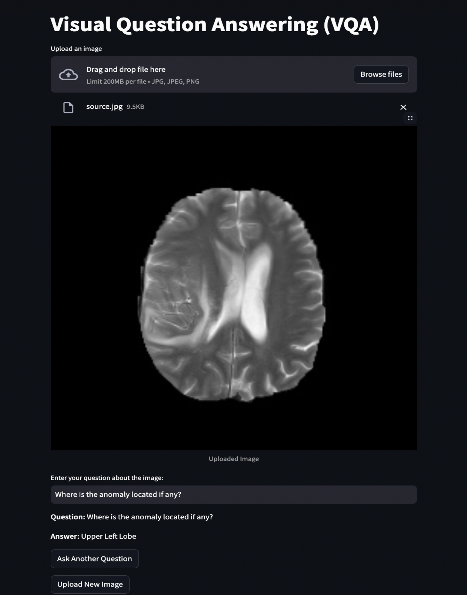

# Medical-VQA
This project fine-tunes advanced multimodal models, ViLT and BLIP-2, for medical Visual Question Answering (VQA) using the SLAKE dataset. It evaluates performance with F1 and Exact Match metrics, showcasing how LoRA fine-tuning and BLIP-2’s modular design outperforms ViLT for domain-specific tasks.

## **Key Components**

### 1. **Dataset Preparation**
- **Dataset**: The **SLAKE dataset** was used for medical Visual Question Answering (VQA).
- **Processing**:
  - Images were preprocessed using **Pillow** and encoded for model input with `ViltProcessor` (ViLT) and `AutoProcessor` (BLIP-2).
  - Questions were tokenized into natural language prompts for BLIP-2 model.
  - Answers were mapped to unique labels using a `label2id` dictionary for classification compatibility of ViLT model.
- **Utilities**:
  - `data.py`: Handles loading, preprocessing, and splitting of the SLAKE dataset into training, validation, and test sets.
  - `utils.py`: Includes helper functions for image resizing, normalization, and tokenized question-answer pairing.

### 2. **Model Fine-Tuning**
- **ViLT**:
  - Baseline model with lightweight design.
  - Divides images into patches, flattens them, and passes through a transformer encoder.
  - Fine-tuned for medical VQA with a classification head.
- **BLIP-2**:
  - Combines a frozen vision encoder, Querying Transformer (Q-Former), and a large language model.
  - Fine-tuned using **LoRA (Low-Rank Adaptation)** for efficient parameter updates.

### 3. **Training Configuration**
- Utilized **Google Colab Pro** with **A100 GPU** for accelerated training.
- **LoRA Fine-Tuning**:
  - Implemented **Low-Rank Adaptation (LoRA)** for BLIP-2 to enable parameter-efficient training by freezing most of the pre-trained parameters and updating only a small number of additional trainable weights in the Querying Transformer (Q-Former).
  - LoRA reduces memory usage and speeds up training while maintaining performance.
  - Configuration:
    - Rank (`r`): 8
    - Alpha: 32
    - Dropout: 0.1
- **Hyperparameters**:
  - Batch size: 64 for both models
  - Learning rate: 2e-3 (BLIP-2) | 2e-5 (ViLT)
  - Epochs: 10 (BLIP-2) | 3 (ViLT)
- Used **mixed-precision training (FP16)** to optimize resource usage.

### 4. **Evaluation**
- Metrics: **SQuAD v2 metrics** (Exact Match and F1 score).
  - **Exact Match (EM)**: Measures the percentage of predictions that exactly match the ground truth.
  - **F1 Score**: Balances precision and recall to evaluate partial matches.
- Results:
  - **ViLT**: F1 score of 0.7166.
  - **BLIP-2**:
    - F1 score: **0.7957**.
    - Exact Match (EM): **75.77%**.

### 5. Visual Question Answering (VQA) App

This Visual Question Answering (VQA) application allows users to upload medical radiology images, ask questions about them, and receive AI-generated answers. It provides a seamless interface for interpreting and querying visual content in medical images, such as X-rays or MRIs.

The VQA app was deployed using a combination of **Google Cloud Platform (GCP)** for the backend and **Hugging Face Spaces** for the frontend:

---

#### 1. Backend Deployment on Google Cloud Platform (GCP)
- **Containerization with Docker:**
  - The backend, built with FastAPI, was containerized using Docker to create a portable and scalable application.
  - The container includes the model and code for handling image uploads and answering user questions.
  
- **Hosting on Cloud Run:**
  - The Docker image was pushed to Google Container Registry (GCR).
  - Using **Google Cloud Run**, the container was deployed as a serverless, managed service.
  - Cloud Run provided a public URL for accessing the backend, ensuring scalability and low maintenance.

- **Endpoints Provided by the Backend:**
  - `/upload_image`: Accepts a medical image, processes it, and returns an `image_id`.
  - `/ask_question`: Accepts an `image_id` and a question, and returns the AI-generated answer.

---

#### 2. Frontend Deployment on Hugging Face Spaces
- **Frontend Design with Streamlit:**
  - The frontend is a Streamlit application providing a user-friendly interface.
  - Users can upload images, submit questions, and receive answers from the backend.

- **Hosting on Hugging Face Spaces:**
  - The frontend was hosted on **Hugging Face Spaces**, a platform for hosting machine learning demos.
  - The Streamlit app communicates with the backend using the public API endpoint deployed on GCP.
  - Hugging Face Spaces provides a shareable, interactive environment for users to test the app.

---

#### Workflow Summary
1. **Backend Workflow:**
   - The FastAPI backend processes incoming requests via two endpoints:
     - Upload an image: Returns a unique identifier for the image (`image_id`).
     - Answer a question: Processes the question and image using the AI model and returns an answer.

2. **Frontend Workflow:**
   - The Streamlit frontend allows users to:
     - Upload a medical image.
     - Interact with the image by asking questions.
     - Display the image and the AI-generated answers.

3. **Integration:**
   - The frontend communicates with the backend by sending HTTP requests to the Cloud Run API URL.

---
#### Try the App

You can try the application live on Hugging Face Spaces:

👉 [Medical VQA Application](https://huggingface.co/spaces/manan145/Medical-VQA)

---

#### Deployment Benefits
- **Scalable Backend:** Google Cloud Run ensures the backend scales automatically based on demand.
- **User-Friendly Frontend:** Hugging Face Spaces simplifies deployment of the Streamlit UI, allowing users to easily access the app via a web interface.
- **Modularity:** The separation of backend (API) and frontend (UI) enables flexibility in maintaining and upgrading the application.
- **Accessibility:** A publicly accessible URL from both Cloud Run and Hugging Face Spaces ensures easy sharing and usage.

---

 

